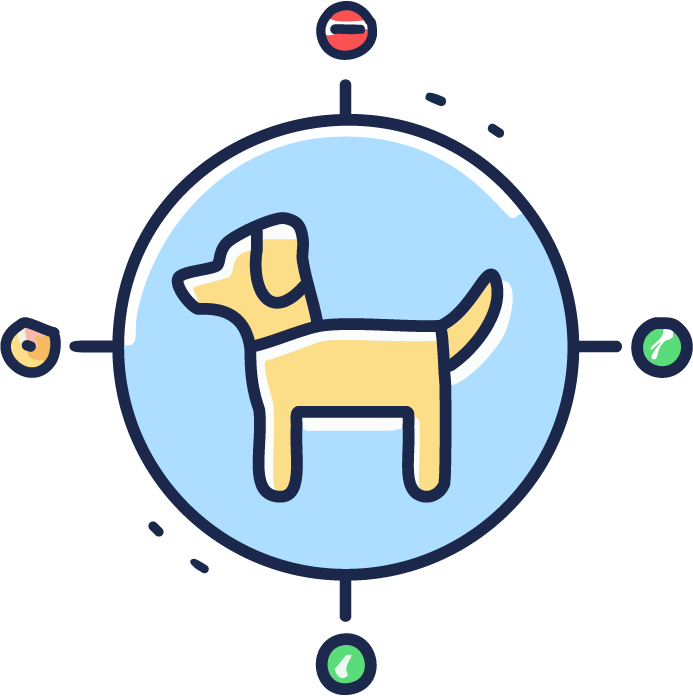

<p align="center">
  
</p>

# NaVILA Benchmark

[](https://docs.python.org/3/whatsnew/3.10.html)
[](https://docs.isaacsim.omniverse.nvidia.com/latest/index.html)
[](https://docs.isaacsim.omniverse.nvidia.com/latest/index.html)

[](https://navila-bot.github.io/)
[](https://arxiv.org/abs/2412.04453)
[](https://huggingface.co/collections/a8cheng/navila-legged-robot-vision-language-action-model-for-naviga-67cfc82b83017babdcefd4ad)
[](https://github.com/yang-zj1026/legged-loco)

## Overview
This Benchmark is a framework for evaluating Visual Language Navigation in Isaac Lab. This repository contains the code and instructions to set up the environment, download the required data, and run the benchmark.

<p align="center">
  
</p>

## TODO List
- [x] Release the VLA example and evaluation code


## Installation

### Prerequisites
- Ubuntu 20.04 or higher
- NVIDIA GPU with CUDA support (check [here](https://docs.omniverse.nvidia.com/isaacsim/latest/installation/requirements.html) for more detailed requirements)

### Steps

1. Create a virtual environment with python 3.10:
    ```sh
    conda create -n vlnce-isaac python=3.10
    conda activate vlnce-isaac
    ```

2. Make sure that Isaac Sim is installed on your machine. Otherwise follow [this guideline](https://docs.omniverse.nvidia.com/isaacsim/latest/installation/install_workstation.html) to install it. If installing via the Omniverse Launcher, please ensure that Isaac Sim 4.1.0 is selected and installed. On Ubuntu 22.04 or higher, you could install it via pip:
    ```sh
    pip install isaacsim-rl==4.1.0 isaacsim-replicator==4.1.0 isaacsim-extscache-physics==4.1.0 isaacsim-extscache-kit-sdk==4.1.0 isaacsim-extscache-kit==4.1.0 isaacsim-app==4.1.0 --extra-index-url https://pypi.nvidia.com
    ```

3. Clone Isaac Lab and link the extensions.

    **Note**: This codebase was tested with Isaac Lab 1.1.0 and may not be compatible with newer versions. Please make sure to use the modified version of Isaac Lab provided below, which includes important bug fixes and updates. As Isaac Lab is under active development, we will consider supporting newer versions in the future.

    ```shell
    git clone https://github.com/yang-zj1026/IsaacLab.git
    cd IsaacLab
    cd source/extensions
    ln -s {THIS_REPO_DIR}/isaaclab_exts/omni.isaac.vlnce .
    ln -s {THIS_REPO_DIR}/isaaclab_exts/omni.isaac.matterport .
    cd ../..
    ```

4. Run the Isaac Lab installer script and additionally install rsl rl in this repo.
    ```shell
    ./isaaclab.sh -i none
    ./isaaclab.sh -p -m pip install -e {THIS_REPO_DIR}/scripts/rsl_rl
    cd ..
    ```

## Data

Download the data from [huggingface](https://huggingface.co/datasets/Zhaojing/VLN-CE-Isaac) and put them under `isaaclab_exts/omni.isaac.vlnce/assets` directory.
The expected file structure should be like:
```graphql
isaaclab_exts/omni.isaac.vlnce
├─ assets
|   ├─ vln_ce_isaac_v1.json.gz
|   ├─ matterport_usd
```

## Code Usage

Run the demo with a PD path planner
```shell
python scripts/demo_planner.py --task=go2_matterport_vision --history_length=9 --load_run=2024-09-25_23-22-02

python scripts/demo_planner.py --task=h1_matterport_vision --load_run=2024-11-03_15-08-09_height_scan_obst
```
To train your own low-level policies, please refer to the [legged-loco](https://github.com/yang-zj1026/legged-loco) repo.

### VLA Evaluation

**Note**: To run the VLA evaluation, a GPU with at least 24GB VRAM is required. Or you can run VLM server on a machine with enough VRAM and connect to it from the machine running the evaluation.

First clone NaVILA and install the dependencies.
```shell
git clone https://github.com/AnjieCheng/NaVILA.git
cd NaVILA

pip install flash-attn==2.5.8
# Install VILA (assum in root dir)
pip install -e .
pip install -e ".[train]"
pip install -e ".[eval]"
# Install HF's Transformers
pip install git+https://github.com/huggingface/transformers@v4.37.2
site_pkg_path=$(python -c 'import site; print(site.getsitepackages()[0])')
cp -rv ./llava/train/transformers_replace/* $site_pkg_path/transformers/
cp -rv ./llava/train/deepspeed_replace/* $site_pkg_path/deepspeed/
```

Then download the pre-trained checkpoint from [a8cheng/navila-llama3-8b-8f](https://huggingface.co/a8cheng/navila-llama3-8b-8f).

Next, we need to open two terminals and run the following commands in each terminal.


```shell
# Terminal 1: VLM Server
python vlm_server.py --model_path MODEL_PATH --port=54321

# Terminal 2: NaVILA IsaacLab Benchmark Evaluation
python scripts/navila_eval.py --task=go2_matterport_vision --num_envs=1 --load_run=go2_matterport_vision --history_length=9 --load_run=2024-09-25_23-22-02 --headless --enable_cameras --episode_idx=0
```
The evaluation measurements and videos will be saved in `eval_results` directory.

It's possible that you'll meet out-of-memory issue with IsaacLab's default configurations. If so, you could adjust the buffer size in `IsaacLab/source/extensions/omni.isaac.lab/omni/isaac/lab/sim/simulation_cfg.py`:
```python
gpu_total_aggregate_pairs_capacity: int = 2**18
"""Capacity of total number of aggregate pairs allocated in GPU global memory. Default is 2 ** 21."""

gpu_collision_stack_size: int = 2**16
"""Size of the collision stack buffer allocated in pinned host memory. Default is 2 ** 26."""

gpu_heap_capacity: int = 2**16
"""Initial capacity of the GPU and pinned host memory heaps. Additional memory will be allocated
  if more memory is required. Default is 2 ** 26."""

gpu_temp_buffer_capacity: int = 2**16
"""Capacity of temp buffer allocated in pinned host memory. Default is 2 ** 24."""

gpu_max_soft_body_contacts: int = 2**16
"""Size of soft body contacts stream buffer allocated in pinned host memory. Default is 2 ** 20."""

gpu_max_particle_contacts: int = 2**16
"""Size of particle contacts stream buffer allocated in pinned host memory. Default is 2 ** 20."""
```

## Citation
If you use VLN-CE-Isaac in your work please consider citing our paper:
```
@article{cheng2024navila,
  title={NaVILA: Legged Robot Vision-Language-Action Model for Navigation},
  author={Cheng, An-Chieh and Ji, Yandong and Yang, Zhaojing and Zou, Xueyan and Kautz, Jan and B{\i}y{\i}k, Erdem and Yin, Hongxu and Liu, Sifei and Wang, Xiaolong},
  journal={arXiv preprint arXiv:2412.04453},
  year={2024}
}
```

## Acknowledgements

This project makes use of the following open-source codebases:
- Isaac Lab: [https://github.com/isaac-sim/IsaacLab](https://github.com/isaac-sim/IsaacLab)
- ViPlanner: [https://github.com/leggedrobotics/viplanner](https://github.com/leggedrobotics/viplanner)
- VLN-CE: [https://github.com/jacobkrantz/VLN-CE](https://github.com/jacobkrantz/VLN-CE)


## License
This project is licensed under the MIT License. See the [LICENSE](LICENSE) file for details.
